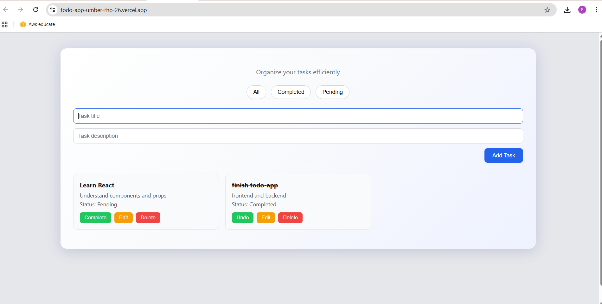
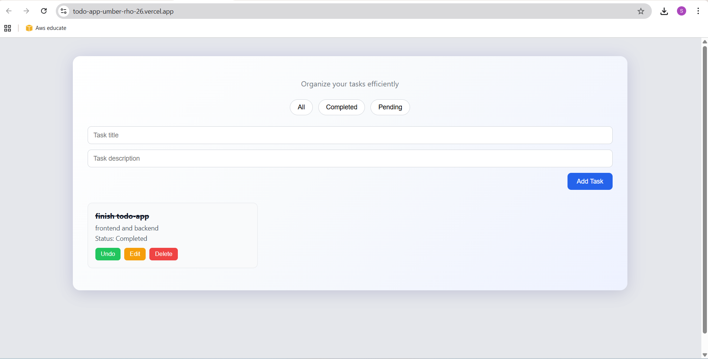
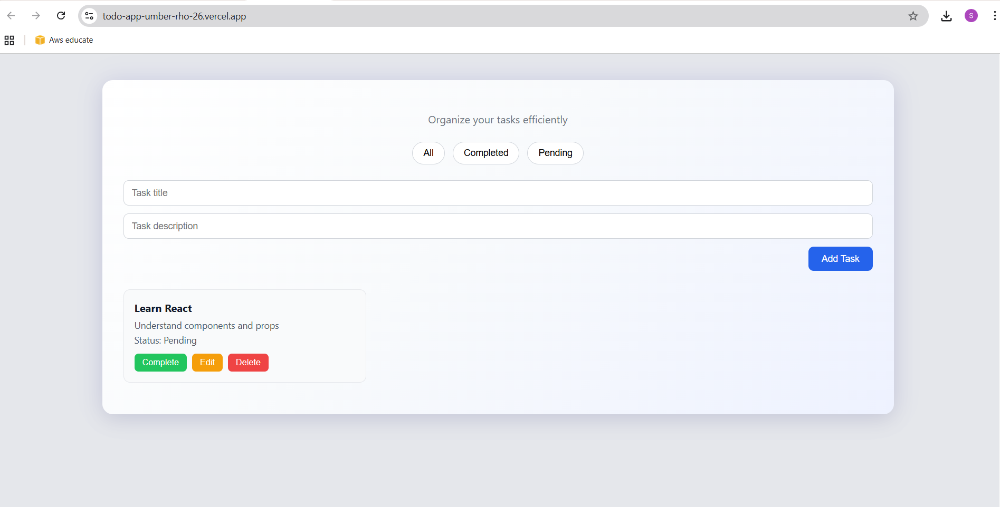

# 📝 Todo App – Full Stack Task Management Application

A full-stack task management web application built using **React, Node.js, and Express**, designed to help users efficiently create, update, organize, and track tasks. The project follows a **monorepo structure** with separate frontend and backend directories, reflecting real-world full-stack development practices.

---

## 🚀 Features

- Create, update, delete, and complete tasks  
- Filter tasks by status (All / Completed / Pending)  
- Clean and responsive user interface  
- RESTful API integration between frontend and backend  
- Monorepo structure with clear separation of concerns  

---

## 🛠️ Tech Stack

**Frontend**
- React.js
- JavaScript
- HTML, CSS

**Backend**
- Node.js
- Express.js
- RESTful APIs

**Deployment**
- Frontend: Vercel  
- Backend: Render  

**Version Control**
- Git & GitHub

---

## 🌐 Live Demo

- **Frontend:** https://todo-app-umber-rho-26.vercel.app

- **Backend API:** "https://todo-backend-wnm2.onrender.com/tasks" 

---

## 📸 Screenshots

### Dashboard


### completed feature


### pending feature


---

## 📂 Project Structure

todo-app/
├── todo-frontend/
├── todo-backend/
├── screenshots/
└── README.md


---

## ⚙️ Local Setup

### Clone the repository
```bash
git clone https://github.com/sphoorthi884/todo-app.git

Frontend Setup
cd frontend
npm install
npm run dev

Backend Setup
cd backend
npm install
npm start

📌 Notes

This project demonstrates full-stack development fundamentals including RESTful API design, frontend-backend integration, component-based UI architecture, and deployment of a production-ready web application.
